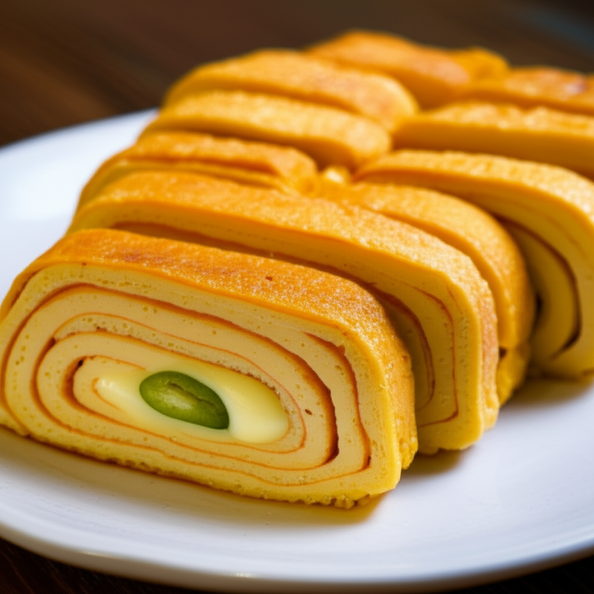

# 치즈 계란말이

> 10분이면 완성! 맥주에 딱 맞는 간단 안주

---

## 재료 (1인분)

- 달걀 3개
- 슬라이스 치즈 2장
- 대파 1/2대 (송송 썰기)
- 소금 한 꼬집
- 식용유 약간

---

## 만드는 법

1. 볼에 달걀 3개를 깨서 넣고, 소금 한 꼬집을 넣어 잘 풀어주세요.
2. 송송 썬 대파를 달걀물에 넣고 골고루 섞어주세요.
3. 팬에 식용유를 두르고 **중약불**로 예열해주세요.
4. 달걀물의 1/3을 팬에 얇게 펴주세요.
5. 달걀이 반쯤 익으면 **슬라이스 치즈**를 올려주세요.
6. 한쪽에서 돌돌 말아주세요. (김밥 말듯이!)
7. 나머지 달걀물도 같은 방법으로 펴고, 이어서 말아주세요.
8. 완성된 계란말이를 먹기 좋은 크기로 잘라 접시에 담아주세요.

---

## 꿀팁

- 달걀물에 **우유 1스푼**을 넣으면 더 부드러워져요.
- **케첩**이나 **마요네즈**를 곁들이면 맛이 두 배!
- 불이 너무 세면 겉은 타고 속은 안 익으니 **중약불**을 유지하세요.

---

| 조리시간 | 난이도 |
|---------|--------|
| 약 10분 | 쉬움   |
